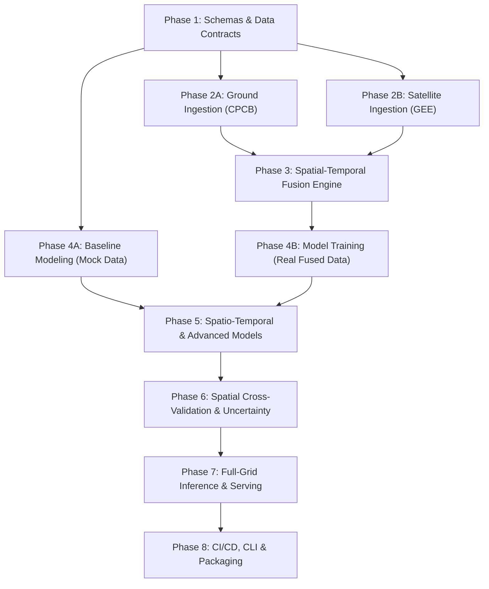

# Vayudrishti-AI 🛰️🌫️ Development Roadmap

Comprehensive, task-by-task sequential implementation plan for the **Vayudrishti-AI** satellite-to-ground AQI estimation and fusion system.

---

## 🗺️ Architecture & Phase Dependency Graph

---

## Phase 1: Schemas, Data Contracts & Validation (Foundation)
> **Objective**: Standardize all input/output data structures across the pipeline to guarantee clean decoupled development and runtime validation.

### Task 1.1: Complete JSON & Pydantic Schema Definitions
- **Goal**: Define canonical schemas for raw ground sensor observations, model inference outputs, and runtime data validation.
- **Deliverables**:
  - `schemas/cpcb_station_schema.json` — Station metadata & hourly pollutant observations (`PM2.5`, `PM10`, `NO2`, `SO2`, `CO`, `O3`, `AQI`).
  - `schemas/aqi_prediction_schema.json` — Model inference output format (spatial geometry/lat/lon, predicted AQI, 90% confidence intervals, dominant pollutant).
  - `schemas/models.py` — Pydantic models for type-safe validation in Python ingestion & inference code.
- **Dependencies**: None.

### Task 1.2: Mock Data & Test Generator Suite
- **Goal**: Expand synthetic data generation to support end-to-end testing without waiting for live satellite / API queries.
- **Deliverables**:
  - `mock_data/generate_mock_data.py` — Expanded to output synthetic ground sensor CSVs and mock raster grids.
  - `mock_data/mock_cpcb_observations.csv` — Synthetic multi-station observations.
  - `tests/test_schemas.py` — Pytest suite ensuring all mock and sample data strictly validate against schemas.
- **Dependencies**: Task 1.1.

---

## Phase 2: Ingestion Pipelines (Ground & Satellite)
> **Objective**: Automate reliable extraction and preprocessing of ground-truth sensor data, satellite retrievals, and auxiliary geospatial datasets.

### Task 2.1: CPCB Ground Truth Sensor Ingestion & QA
- **Goal**: Ingest ground-truth station observations from CPCB / OpenAQ.
- **Deliverables**:
  - `ingestion/cpcb/fetch_cpcb_data.py` — Automated scraper/API client for CPCB / CCR portal.
  - `ingestion/cpcb/cpcb_cleaner.py` — QA filtering, anomaly removal (stuck readings, negative values), and Indian National AQI (NAQI) sub-index calculator.
  - Output storage: `data/raw/ground/cpcb_YYYYMMDD.parquet`.
- **Dependencies**: Task 1.1.

### Task 2.2: Automated GEE Ingestion & GeoTIFF Export Pipeline
- **Goal**: Complete Python-driven Google Earth Engine automated extraction for MODIS, Sentinel-5P TROPOMI, and ERA5-Land.
- **Deliverables**:
  - `ingestion/satellite/scripts/fetch_gee_automated.py` — Earth Engine Python API orchestrator.
  - `ingestion/satellite/preprocessing/` (`aod_processor.py`, `tropomi_processor.py`, `era5_processor.py`) — Resampling, QA masking, and reprojection to a standardized spatial grid (e.g. WGS-84, 0.01° / ~1 km).
- **Dependencies**: Task 1.1.

### Task 2.3: Auxiliary Static Data Ingestion
- **Goal**: Cache and prepare static contextual layers.
- **Deliverables**:
  - `ingestion/auxiliary/fetch_static_features.py` — Download & rasterize ESA WorldCover 2021 (10m), SRTM DEM elevation/slope (30m), WorldPop (100m), and OpenStreetMap road proximity.
  - Output storage: `data/raw/auxiliary/static_india_grid.tif`.
- **Dependencies**: Task 1.1.

---

## Phase 3: Spatial-Temporal Fusion Engine
> **Objective**: Merge disparate spatial raster bands, meteorological variables, and point sensor observations into canonical feature datasets.

### Task 3.1: Spatial Alignment & Point-to-Grid Interpolation
- **Goal**: Spatially and temporally align CPCB ground points with satellite overpasses (Terra ~10:30 LT, Aqua/TROPOMI ~13:30 LT) and ERA5 hourly data.
- **Deliverables**:
  - `ingestion/fusion/spatial_matcher.py` — Spatial buffers, nearest-neighbor & bilinear extraction, temporal alignment window.
  - Missing value handler & cloud-cover flagger.
- **Dependencies**: Tasks 2.1, 2.2, 2.3 (or Task 1.2 on mock data).

### Task 3.2: Canonical Dataset Builder & Parquet Storage
- **Goal**: Build the unified training/testing dataset adhering strictly to `schemas/aqi_feature_schema.json`.
- **Deliverables**:
  - `ingestion/fusion/build_canonical_dataset.py` — End-to-end dataset builder.
  - Partitioned storage layout: `data/processed/year=YYYY/month=MM/features.parquet`.
- **Dependencies**: Task 3.1.

---

## Phase 4: Exploratory Analysis & Baseline Modeling
> **Objective**: Establish robust baseline ML benchmarks for continuous AQI regression and categorical classification.

### Task 4.1: Exploratory Data Analysis (EDA) & Feature Relationships
- **Goal**: Uncover key relationships (AOD vs PM2.5, NO₂ vs AQI, boundary layer height inversion, seasonal patterns).
- **Deliverables**:
  - `notebooks/01_eda_and_correlations.ipynb` — Visualizations of correlations, spatial variograms, and missingness distributions.
- **Dependencies**: Task 3.2 (or Task 1.2 on mock data).

### Task 4.2: Tabular ML Baseline Models (LightGBM, XGBoost, CatBoost)
- **Goal**: Train baseline models to predict continuous AQI and classify AQI buckets (Good, Satisfactory, Moderate, Poor, Very Poor, Severe).
- **Deliverables**:
  - `models/baselines/train_tabular.py` — Scikit-learn / LightGBM pipeline with Optuna hyperparameter optimization.
  - `models/baselines/evaluate_baselines.py` — Benchmark reports (RMSE, MAE, R², Weighted F1).
- **Dependencies**: Task 3.2.

---

## Phase 5: Advanced Spatio-Temporal Models
> **Objective**: Capture spatial continuity and geographic auto-correlation using deep learning and graph architectures.

### Task 5.1: Spatial Cross-Validation Strategy (Leave-Region-Out)
- **Goal**: Implement spatial K-fold and temporal holdout splitters to prevent spatial data leakage.
- **Deliverables**:
  - `models/fusion/cv_splitters.py` — Spatial cluster cross-validation (Spatial K-Fold / Block CV) & seasonal holdout.
- **Dependencies**: Task 4.2.

### Task 5.2: Spatio-Temporal Neural Model / Graph Neural Network
- **Goal**: Implement spatial convolutional or graph-based fusion networks for multi-modal raster and point fusion.
- **Deliverables**:
  - `models/fusion/spatial_nn.py` — PyTorch-based UNet / ResNet or Graph Convolutional Network (GCN).
  - `models/fusion/train_fusion_model.py` — Training script with checkpointing and TensorBoard/WandB logging.
- **Dependencies**: Tasks 3.2, 5.1.

---

## Phase 6: Uncertainty Estimation & Model Explainability
> **Objective**: Provide probabilistic confidence bounds and explainable feature contributions.

### Task 6.1: Quantile Regression & Confidence Intervals
- **Goal**: Output 10th, 50th, and 90th percentile AQI predictions for uncertainty-aware estimation during cloudy or noisy overpasses.
- **Deliverables**:
  - `models/evaluation/uncertainty.py` — Quantile loss training and calibration curves.
- **Dependencies**: Task 5.1.

### Task 6.2: Model Explainability (SHAP & Attribution)
- **Goal**: Explain predictions for policy decision-making (e.g., distinguishing stubble burning smoke vs traffic emissions vs meteorological stagnation).
- **Deliverables**:
  - `notebooks/02_model_explainability.ipynb` — TreeSHAP summary, waterfall plots, and spatial feature attribution maps.
- **Dependencies**: Task 5.1.

---

## Phase 7: Full-Grid Raster Inference & Serving
> **Objective**: Generate wall-to-wall high-resolution AQI heatmaps over unmonitored regions and expose an API.

### Task 7.1: Full-Grid Raster Inference Engine
- **Goal**: Batch-predict AQI over whole regions (e.g. Delhi-NCR, Indo-Gangetic Plain, All-India) from input raster stacks.
- **Deliverables**:
  - `models/inference/predict_raster.py` — Efficient tiled raster predictor producing GeoTIFF / Cloud Optimized GeoTIFF (COG) AQI maps.
- **Dependencies**: Tasks 3.2, 5.1, 6.1.

### Task 7.2: Fast API Server & Interactive Map Visualizer
- **Goal**: Expose an API for point/polygon queries and an interactive map interface.
- **Deliverables**:
  - `api/main.py` — FastAPI service with `/predict/point` and `/predict/raster` endpoints.
  - `notebooks/03_interactive_map_demo.ipynb` — Interactive Folium/Mapbox map for visual inspection.
- **Dependencies**: Task 7.1.

---

## Phase 8: Automation, Testing, CI/CD & Deployment
> **Objective**: Productionize the system with end-to-end integration tests, unified CLI, and containerization.

### Task 8.1: End-to-End Test Suite
- **Deliverables**:
  - `tests/test_ingestion.py` — Ingestion unit tests.
  - `tests/test_fusion.py` — Spatial fusion integrity tests.
  - `tests/test_inference.py` — Model inference and shape validation tests.
- **Dependencies**: Tasks 2.2, 3.2, 7.1.

### Task 8.2: Unified CLI & Dockerization
- **Deliverables**:
  - `cli.py` — Unified Click CLI (`vayudrishti ingest`, `vayudrishti train`, `vayudrishti predict`).
  - `Dockerfile` & `docker-compose.yml` for reproducible containerized execution.
- **Dependencies**: All preceding tasks.

---

## 📊 Summary Matrix

| Phase | Main Deliverable | Dependencies | Concurrent Options |
|---|---|---|---|
| **Phase 1** | Schemas & Pydantic Models | *None* | Foundation for all |
| **Phase 2** | Ground & Satellite Ingestion | Phase 1 | CPCB (2.1) & Satellite (2.2) run concurrently |
| **Phase 3** | Data Fusion Engine | Phase 2 | — |
| **Phase 4** | Baselines & EDA | Phase 1 (mock) or Phase 3 (real) | Baseline models can be developed on mock data |
| **Phase 5** | Spatial & Fusion Deep Models | Phase 3, Phase 4 | — |
| **Phase 6** | Uncertainty & SHAP | Phase 5 | Can run alongside Phase 7 |
| **Phase 7** | Raster Inference & API | Phase 5 | Can run alongside Phase 6 |
| **Phase 8** | Unified CLI, Tests & Docker | Phase 7 | — |
