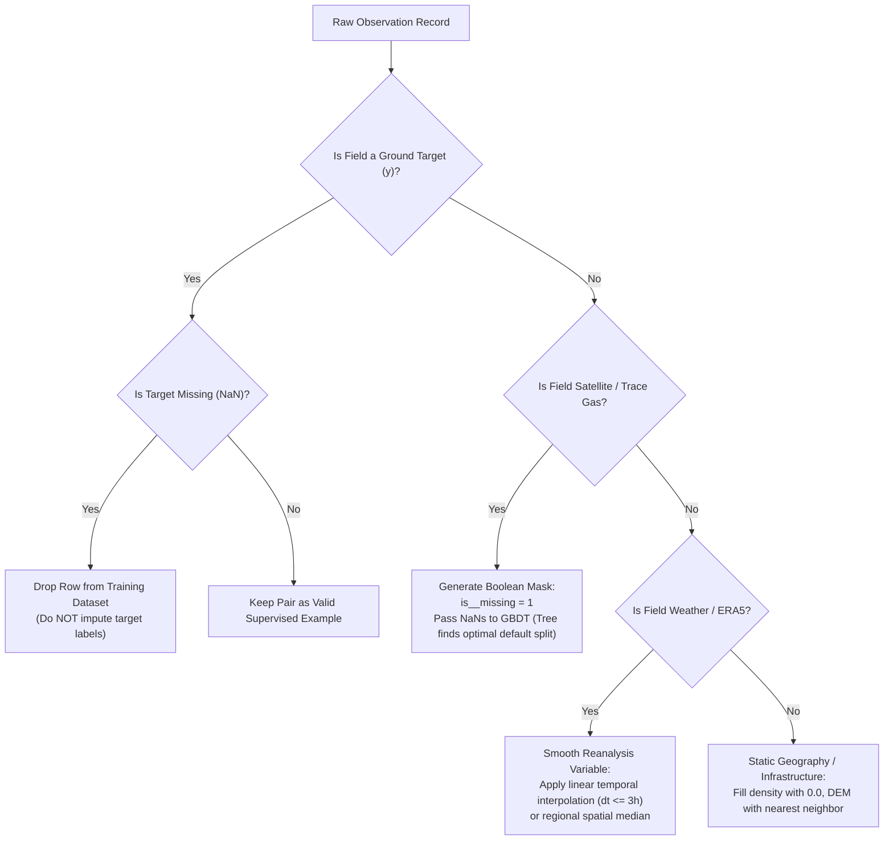

# Missing Data Policy & Imputation Strategy 📊

> **Pipeline Guideline**: Detect $\rightarrow$ Flag $\rightarrow$ Handle  
> **Rule of Thumb**: **Never blindly impute missing training targets ($y$).** Distinguish between physical unobserved values (e.g. cloud cover over satellite) and sensor glitches.

---

## 1. Variable-by-Variable Policy Matrix

| Variable Category | Specific Fields | Missingness Mechanism | Policy for Model Training | Policy for Full Grid Inference | Imputation Method |
|:---|:---|:---|:---|:---|:---|
| **Ground Target ($y$)** | `ground_pm25`, `ground_pm10`, `aqi_label` | Station downtime, calibration gaps, sensor freeze | **DROP ROW** (Never train on synthetic/hallucinated targets) | **PREDICT** (This is what the model estimates) | None (Drop in train) |
| **Satellite AOD** | `aod_550nm`, `aod_470nm` | Cloud obscuration, high surface reflectance (snow/sand) | **FLAG & RETAIN** (`is_aod_missing = 1`) | **FLAG & INFER** via Tree or Spatial KNN | LightGBM/XGBoost native missing split; Spatio-temporal Kriging / KNN for Neural Nets |
| **Satellite Trace Gases** | `satellite_no2`, `satellite_so2`, `satellite_co`, `satellite_o3`, `uv_aerosol_index` | Cloud cover ($qa < 0.75$), orbital swath gaps | **FLAG & RETAIN** (`is_satellite_<gas>_missing = 1`) | **FLAG & INFER** via Tree or Monthly Pixel Climatology | Native NaN branch in GBDT; Historical monthly pixel median for Deep Learning |
| **Meteorology** | `temperature_2m`, `relative_humidity_2m`, `surface_pressure` | Data feed lag | **INTERPOLATE** | **INTERPOLATE** | Temporal cubic spline / linear interpolation ($\le 3\text{ hours}$); ERA5 spatial neighborhood mean |
| **Wind & Dispersion** | `wind_speed_10m`, `wind_direction_10m`, `boundary_layer_height` ($PBLH$) | Reanalysis boundary errors | **BOUND & INTERPOLATE** | **BOUND & INTERPOLATE** | Bilinear spatial interpolation; Clip $PBLH \ge 50\text{ m}$; default to regional diurnal median |
| **Geospatial Infrastructure** | `road_density`, `building_density`, `distance_to_road_km` | Rural areas with no OSM features | **FILL ZERO / PHYSICAL MIN** | **FILL ZERO / PHYSICAL MIN** | Zero-fill density (`0.0 km/km²`, `0.0%`); Max-distance clamp for road distance (`50 km`) |
| **Topography & DEM** | `elevation_m` | SRTM water body voids | **SPATIAL INTERPOLATE** | **SPATIAL INTERPOLATE** | Spline spatial filling / nearest neighbor elevation |
| **Land Use** | `land_use_class` | Unclassified pixels | **DEFAULT TO REGIONAL MODE** | **DEFAULT TO REGIONAL MODE** | Mode class (e.g. `Cropland` or `Built-up` if building density $> 30\%$) |

---

## 2. Decision Tree Workflow

---

## 3. Why GBDTs Handle Missing Satellite Data Natively

1. **Optimal Missing Split Routing**: In LightGBM and XGBoost, every tree split learns a default direction (left or right branch) for missing values during training based on whichever branch minimizes the objective loss.
2. **Missing Indicator Features**: When cloud cover causes missing AOD, the *absence* of the observation is itself predictive (clouds often correlate with rain and pollutant washout). By passing both the raw feature and `is_aod_missing = 1`, the model learns to condition on weather variables and land use during overcast periods.
